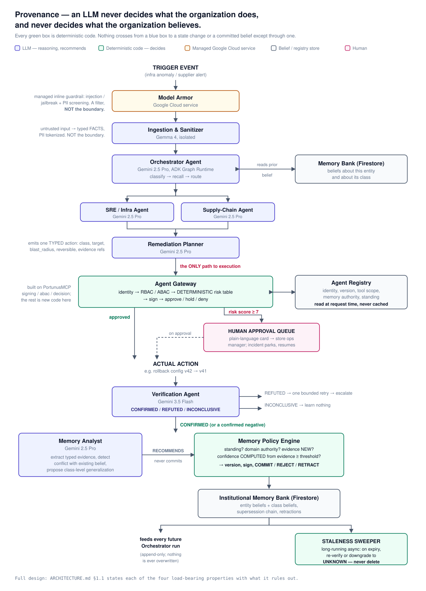

# Provenance

**An enterprise that can prove what it believes.**

A fleet of agents runs continuously against a live enterprise: it detects operational deviations, diagnoses them against what the organization has already learned, proposes a fix, and executes it only through a deterministic policy layer no agent can talk its way past. It then verifies the outcome, and — only if the outcome could actually be confirmed — writes a provenance-bound belief back into a governed institutional memory, where that belief carries computed confidence, decays on a schedule, can be superseded by better evidence, and can be retracted when reality disproves it.

**The claim: an LLM never decides what the organization does, and never decides what the organization believes.** Everything in this repo is the machinery that makes that true rather than aspirational.

Self-healing is the surface. Governed institutional belief is the product.

> Built for the **All Things Agentic Hackathon** (Devpost/Google), Fortified Enterprise Fleet track. Deadline: August 31, 2026, 5:00 PM PDT. How the project maps to the track's requirements is in [`docs/submission.md`](./docs/submission.md).

## Why

Most "agentic enterprise" systems are single-domain and stateless: one agent, one workflow, one report, no memory of yesterday. Three problems come with the shift to continuous multi-domain fleets:

1. **No institutional memory — and the common fix is the wrong abstraction.** A vector index over past incidents retrieves *text similar to now*. It cannot answer "what do we currently believe about Supplier X," because it has no notion of *current*: no supersession, no provenance, no expiry, no way for a later fact to overrule an earlier one. Institutional knowledge is a versioned model of what the organization holds to be true, and what it would accept as grounds for changing its mind.
2. **No governance on autonomous action.** An agent that can diagnose a problem can usually also make it worse. Every state-mutating action must be gated by identity, policy, and evidence, deterministically, every time.
3. **No generalized loop.** Most fleets are built for exactly one kind of incident. An enterprise nervous system has to run the *same* control loop across domains, not a bespoke pipeline per problem type.

   *Measured, not asserted:* the second domain (Supply-Chain) cost **114 lines in one agent file and zero in a registry entry**, with no change to any decision path in the gateway, the risk table or the Memory Policy Engine — at the price of **207 behavioural lines** spent making a single-domain loop multi-domain, every one of them itemized in [`docs/generality-report.md`](./docs/generality-report.md) rather than rounded away.

## The core abstraction

Two nested loops, applied uniformly regardless of domain:

**The action loop** (any single agent proposal):

```
PROPOSE → AUTHORIZE → EXECUTE → VERIFY → REMEMBER
```

**The incident loop** (any detected deviation):

```
OBSERVE → DIAGNOSE → PROPOSE → AUTHORIZE → EXECUTE → VERIFY → LEARN
                          ↑                                  │
                          └────── retry (bounded) ───────────┘
                                                             │
                                                    escalate to human
```

Agents propose. A deterministic policy layer decides. Systems execute. Verification proves or refutes the outcome. Memory learns only from what was confirmed.

**The recursion is the idea:** the memory write path *is* the action loop, applied to the system's own beliefs. A probabilistic component recommends; a deterministic component decides. An LLM never gets the final word on what becomes organizational truth, for exactly the same reason it never gets the final word on whether a production rollback executes. The system prompt is never the security boundary — the registry, the gateway, and the policy engines are.

## Architecture



<details><summary>The same diagram as text</summary>

```
                              TRIGGER EVENT
                     (infra anomaly / supplier alert)
                                    │
                                    ▼
                       ┌─────────────────────────┐
                       │  Model Armor             │  ← managed inline guardrail:
                       │  (Google Cloud service)  │    injection/jailbreak + PII
                       └────────────┬─────────────┘    screening. A filter, NOT
                                    ▼                  the boundary.
                       ┌─────────────────────────┐
                       │  Ingestion & Sanitizer   │  ← untrusted input → typed FACTS
                       │  (Gemma 4, isolated)     │    PII tokenized. NOT the boundary.
                       └────────────┬─────────────┘
                                    ▼
                       ┌─────────────────────────┐        ┌──────────────────┐
                       │   Orchestrator Agent     │◀──────▶│  Memory Bank     │
                       │   (Gemini 2.5 Pro, ADK)  │  reads │  (beliefs about  │
                       │   classify → recall →    │ prior  │   this entity +  │
                       │   route                  │ belief │   its class)     │
                       └────────────┬─────────────┘        └──────────────────┘
                                    │
                       ┌────────────┴────────────┐
                       ▼                         ▼
                SRE/Infra Agent          Supply-Chain Agent
                     │                         │
                     └────────────┬────────────┘
                                  ▼
                       ┌─────────────────────────┐
                       │   Remediation Planner    │  ← one TYPED action:
                       │   (Gemini 2.5 Pro)       │    class, target, blast_radius,
                       └────────────┬─────────────┘    reversible, evidence refs
                                    │
                                    │  ← the ONLY path to execution
                                    ▼
              ┌───────────────────────────────────────────┐      ┌──────────────┐
              │        Agent Gateway (PortunusMCP)         │◀────▶│   AGENT      │
              │  identity → RBAC/ABAC → DETERMINISTIC risk │ read │  REGISTRY    │
              │  table → sign → approve / hold / deny      │ perms│  identity,   │
              └───────────────┬──────────────┬─────────────┘ +    │  scope,      │
                    approved  │              │ score ≥ 7    stand-│  standing    │
                              │              ▼              ing   └──────────────┘
                              │      HUMAN APPROVAL QUEUE
                              │      (plain-language card → store ops
                              │       manager; incident parks, resumes)
                              ▼
                        ACTUAL ACTION  (e.g. rollback config v42→v41)
                              │
                              ▼
                 ┌─────────────────────────┐
                 │   Verification Agent     │ ── REFUTED ──▶ bounded retry ──▶ escalate
                 │   (Gemini 3.5 Flash)     │ ── INCONCLUSIVE ──▶ learn nothing
                 │  CONFIRMED / REFUTED /   │
                 │  INCONCLUSIVE            │
                 └────────────┬─────────────┘
                              │ CONFIRMED (or a confirmed negative)
                              ▼
        ┌─────────────────────────┐        ┌───────────────────────────────┐
        │     Memory Analyst       │───────▶│    Memory Policy Engine        │
        │  (Gemini 2.5 Pro)        │ RECOM- │    (DETERMINISTIC CODE)        │
        │  extract typed evidence, │ MENDS  │  standing? domain authority?   │
        │  detect conflict with    │        │  evidence NEW? confidence      │
        │  existing belief,        │        │  COMPUTED from evidence ≥      │
        │  propose class-level     │        │  threshold? → version, sign,   │
        │  generalization          │        │  COMMIT / REJECT / RETRACT     │
        └──────────────────────────┘        └────────────┬───────────────────┘
                                                          │
                                       ┌──────────────────▼──────────────────┐
                                       │   Institutional Memory Bank          │
                                       │   entity beliefs + class beliefs,    │
                                       │   supersession chain, retractions    │
                                       └──────────────────┬───────────────────┘
                                                          │
                              ┌───────────────────────────┴──────────┐
                              ▼                                      ▼
                    feeds every future                    STALENESS SWEEPER
                    Orchestrator run                      (long-running async):
                                                          on expiry → re-verify
                                                          or downgrade to UNKNOWN
```

</details>


Four properties are load-bearing and non-negotiable in implementation:

1. **There is no direct path from any reasoning agent to a state-mutating action.**
2. **The memory write path mirrors the action path exactly.**
3. **No LLM-generated number is an input to a deterministic decision.**
4. **The registry is read at request time, not at boot.**

Each is stated with what it rules out in [`ARCHITECTURE.md`](./ARCHITECTURE.md) §1.1 — which is also the full design: every component in depth, the determinism boundary, the memory model, failure modes, observability, testing strategy, and deployment.

## Threat model (summary)

Full detail, including the assumptions the model rests on, in [`THREAT_MODEL.md`](./THREAT_MODEL.md).

| Threat | Protected? | Mechanism |
|---|---|---|
| Prompt injection embedded in inbound data | **Yes (layered; boundary is the gateway)** | Model Armor screens, Gemma sanitizer reduces to typed facts — both are filters that can leak. The gateway scores the *typed action* on objective properties; an injected instruction cannot skip PROPOSE → AUTHORIZE |
| Memory poisoning (false belief injection) | **Yes (arithmetic)** | `unverified_external_claim` evidence has weight 0.00 — computed confidence does not move; status flips require a different source class |
| Repeated poisoning attempts by a compromised agent | **Yes** | Registry standing degrades after 3 rejected writes; a DEGRADED agent needs human approval for everything, and its memory writes are rejected outright |
| Hallucinated / fabricated action | **Yes** | Dies at schema validation before the gateway sees it; second malformed emission escalates to a human |
| Plausible-but-wrong action that validates | **Yes (downstream)** | Risk table on objective properties, then verification against a pre-declared predicate; a wrong action gets REFUTED and becomes a learned negative belief |
| PII leakage into memory | **Yes** | Model Armor SDP screening at ingest; sanitizer tokenizes what remains; beliefs reference entity IDs, never raw personal data |
| Verification failing the way production fails | **No (disclosed)** | Verification runs against a synthetic system whose state we control; failure paths are exercised via fault injection, not real-world ambiguity |

## Quickstart

**Local dev** (Python 3.12):

```bash
python3.12 -m venv .venv
.venv/bin/pip install -e ".[dev]"
.venv/bin/pip install --no-deps portunusmcp==0.1.0   # mandatory second step — see below
.venv/bin/pytest
```

The second install is separate on purpose: `portunusmcp` pins `fastapi==0.115.6`, which pip would silently downgrade out of `google-adk`'s supported range rather than reporting a conflict. `pip check` therefore exits non-zero in this environment by design, and CI does not gate on it.

**Google Cloud** (project, APIs, IAM, Firestore, and a live Gemini access probe):

```bash
gcloud auth login && gcloud auth application-default login
./scripts/gcp_setup.sh     # idempotent; PROJECT_ID and REGION override the defaults
```

**Deploy** — one command from a clean checkout, and it checks its own result:

```bash
PROVENANCE_PLANNER_KEY="$(cat ~/planner.pem)" PROVENANCE_TRIGGER_TOKEN=... \
  ./scripts/deploy.sh      # PROJECT_ID, REGION and SERVICE override the defaults
```

Both variables are required since item 9. The Remediation Planner signs its own gateway
credential and the registry stores no private halves, so the PEM has to arrive from outside
the repo; the trigger token guards `POST /trigger`, which spends model tokens on every call
against a fixed credit.

Live: **https://provenance-808273007560.us-central1.run.app** (`/health` for the service
state). The service is public and runs at `min-instances=0`, so it bills nothing idle.

**Wake the fleet** — one trigger in, one incident run to its end:

```bash
curl -X POST https://provenance-808273007560.us-central1.run.app/trigger \
  -H 'Content-Type: application/json' -H "X-Provenance-Token: ${PROVENANCE_TRIGGER_TOKEN}" \
  -d '{"target":"inventory-api","observed_value":0.38,"observed_at":"2026-08-21T14:06:00Z"}'
```

It takes about a minute. Three sequential `gemini-2.5-pro` calls classify the deviation,
diagnose it, and turn it into one typed `ROLLBACK_CONFIG` action, which the risk table scores
`1 + 1 + 0 + 0 = 2` and auto-approves. Since item 10 the rollback then *executes* — the
executor re-verifies the signed decision before it writes anything — a `gemini-3.5-flash`
Verification Agent judges the measured post-state against the success predicate the Planner
declared **before** execution, and a `CONFIRMED` outcome commits one belief at confidence
`1 − (1 − 0.60) = 0.60`, computed by §4.3's published formula rather than asserted by any
model. The response carries all of it: `execution`, `verification` and `belief`, each `null`
when the path was not taken. Without the header it answers 403.

Inject the fault first if you want the rollback to have something to fix
(`scripts/inject_fault.py`); since item 12 a second run against the same service commits a
**superseding version** of the belief rather than being refused — v1 is left exactly as it
was written, and v2 links back to it.

**Answer a held action** — the human approval path (§2.1 stage 7). An action the risk table
scores 7 or higher, or one proposed by a `DEGRADED` agent, is **held**: nothing executes, and
the incident parks in a queue that outlives the process holding it. See what is waiting, then
answer it:

**The approval card is the surface for this** — open the service root in a browser and the
*Approval card* panel shows every held action in plain language: what the fleet wants to do,
why, and the risk score component by component with the reason it stopped. Approve or deny it
there; the token is the one already in the trigger strip above it. Nothing on the card is
written by a model — the arithmetic comes from the §4.2 lookup table
(`docs/adr/ADR-033-the-approval-card.md`).

The same thing over HTTP, for a terminal: a held incident's `/trigger` response carries the
`approval_id` to answer, and `GET /approvals` lists everything waiting (with the risk breakdown
and the hold reason on each record):

```bash
curl https://provenance-808273007560.us-central1.run.app/approvals            # open, no token
curl -X POST https://provenance-808273007560.us-central1.run.app/approvals/appr-... \
  -H 'Content-Type: application/json' -H "X-Provenance-Token: ${PROVENANCE_TRIGGER_TOKEN}" \
  -d '{"verdict":"approve","approver":"dana.ruiz"}'
```

Reading the queue needs no token; answering uses the same one as `/trigger`, because a resume
runs the Verification Agent and so spends model tokens. On `approve` the incident picks up
exactly where it stopped — execute, verify, learn — on a fresh clock, days later if that is how
long the human took. On `deny` nothing executes and the refusal is signed into the same ledger
an approval goes to, carrying the name of whoever gave it. **Nothing auto-approves on timeout**,
and a verdict is accepted once: a second `POST` answers 409. The gateway does not trust the
parked record — it re-validates the proposal, re-reads the agent's standing and recomputes the
risk arithmetic before it signs anything, so an action whose agent was suspended during the
park is denied whatever the human says.

**Seed the synthetic company** — the entity model every incident recurs over:

```bash
GOOGLE_CLOUD_PROJECT=provenance-hackathon .venv/bin/python scripts/seed_firestore.py
```

Idempotent: a re-run leaves existing documents untouched, so it never clobbers state a
demo take has already changed. `--reset` rewrites every document back to the baseline —
`inventory-api` on v42 over a known-good v41, nominal error rates, every fault switch off —
which is the between-takes reset for rehearsal. It reads all 26 documents back and exits
non-zero if any is missing or does not match the fixture.

*Judge credentials land with later phases — see [`ROADMAP.md`](./ROADMAP.md).*

## Run the demo

Two audiences, and the first one needs nothing but a browser.

Live: **https://provenance-808273007560.us-central1.run.app**

**Everything below happens in the browser. You do not need a terminal, a checkout, or
credentials of your own.**

One thing to set up first: the page has a **token** field in the trigger strip at the top.
Paste this into it and leave it there —

```
f18588110213f0705e4e96bf9ab524cac0e1580f9ac1c58b
```

— because that single field is read by *both* the "Wake the fleet" button and the Approve /
Deny buttons on the approval card. Fill it once and the whole walkthrough works.

The token is deliberately public. The service runs at `--max-instances=1` and an incident
takes about a minute serially, so the worst a stranger can do is make the queue wait; it is
rotated after judging closes. It guards the two writing routes — `POST /trigger` and
`POST /approvals/{id}` — and nothing else. Every read surface is unauthenticated on purpose,
because reading the queue is not the same act as answering it.

### Walkthrough — the URL and nothing else

**First, what an empty panel means.** The service runs at `min-instances=0`, so your first
request wakes a cold instance and takes a few seconds. The **live fleet view** and **gateway
ledger** render an in-process span buffer, so until you trigger something they are empty. That
is scale-to-zero, not a broken page. The other four surfaces read Firestore or a committed
file and are populated the moment the page loads — start there, so the first thing you see is
the system's memory rather than its idle state.

1. **Belief inspector** — `SUP-042` is prefilled; press *Inspect*. This is the institutional
   memory: a versioned belief with its provenance, its typed evidence, a confidence that was
   *computed* rather than asserted, and a supersession chain. Two separate attacks in this repo
   — a prompt injection (item 27) and a memory-poisoning attempt (item 28) — targeted this exact
   chain, and it is byte-identical after both.
2. **Registry panel** — every agent's identity, version, declared tool scope and **standing**.
   The gateway re-reads this on every single authorization rather than caching it at boot,
   which is what lets standing move mid-incident and be obeyed on the next request.
3. **Counterfactual panel** — the A/B measurement of what recall is worth, including the run
   where it came back **against** the design. It serves a committed artifact rather than
   re-running, because a button that spent twelve live incidents would answer differently every
   afternoon. Method and full numbers: [`docs/counterfactual-report.md`](./docs/counterfactual-report.md).
4. **Wake the fleet on the supply-chain incident.** In the trigger strip set:

   | field | value |
   |---|---|
   | target | `SUP-042` |
   | signal | `compliance_lapse` |
   | observed | `14` |
   | token | the token above |

   Press *Wake the fleet* and wait roughly 45 seconds — three sequential `gemini-2.5-pro` calls
   sit between the trigger and the answer. The Orchestrator classifies the deviation and recalls
   what memory already believes about this supplier; the Supply-Chain Agent diagnoses *against*
   that prior belief; the Remediation Planner emits one typed action.

   The incident ends **`HELD`**. That is the design, not a failure: the only supplier-scoped tool
   available is `DISABLE_COMPLIANCE_CHECKS` against a tier-1 supplier, the deterministic risk
   table scores it past the hold threshold, and no amount of agent confidence can move a number
   the table owns. Nothing executed, so — by the rule that memory learns only from what
   verification could settle — nothing was learned either.

5. **Answer it.** The **approval card** now holds a question addressed to a store operations
   manager, not to an engineer: what the fleet wants to do, what it found, the risk arithmetic
   term by term with the threshold it crossed, and who is being asked. Put your name in the
   approver field and press *Approve* or *Deny*. Either verdict resumes the parked incident on
   the other side of the gateway and lands a signed row in the ledger; only one of them
   executes anything.

6. **Read what it left behind.** The gateway ledger shows the signed authorization; the live
   fleet view shows the reasoning chain as OpenTelemetry spans, each one carrying identifiers,
   hashes and numbers and never content.

This path mutates nothing and can be run again immediately — by you, or by the next person to
open the URL.

<details><summary>The same walkthrough as <code>curl</code>, if you would rather not click</summary>

```bash
URL=https://provenance-808273007560.us-central1.run.app
TOKEN=f18588110213f0705e4e96bf9ab524cac0e1580f9ac1c58b

curl -sX POST "$URL/trigger" -H 'Content-Type: application/json' -H "X-Provenance-Token: $TOKEN" \
  -d '{"target":"SUP-042","signal":"compliance_lapse","observed_value":14.0,"observed_at":"2026-08-24T09:15:00Z"}'
# -> {"outcome":"HELD","approval_id":"...", ...} — the id you need is in the response

curl -s "$URL/approvals"                        # no token needed to read the queue

curl -sX POST "$URL/approvals/<approval_id>" -H 'Content-Type: application/json' \
  -H "X-Provenance-Token: $TOKEN" -d '{"verdict":"approve","approver":"your.name"}'
```

</details>

A denial is a durable answer: the queue keeps the record as `DENIED` and the ledger keeps the
signed row. Nothing here needs cleaning up between visitors.

### The self-healing arc (needs a checkout)

The incident that *executes* — detect, roll back, verify, and commit what it learned — needs a
fault in the world for the fleet to find, and setting one is a Firestore write rather than a
public endpoint. From a checkout with credentials ([Quickstart](#quickstart) first):

```bash
GOOGLE_CLOUD_PROJECT=provenance-hackathon .venv/bin/python scripts/inject_fault.py
# then trigger inventory-api / error_rate / 0.38 — from the page, or the curl in Quickstart
```

**It is one-shot on purpose.** A successful arc rolls the service back to its known-good config
and clears the deviation — the fleet fixed it — so the world it started from is gone. Restore
the fixture with `scripts/seed_firestore.py --reset` before running it again. That is exactly
why the walkthrough above leads with the supply-chain incident instead: a hold is repeatable,
and an execution is not.

Every other beat — the injection arc, the poisoning arc, the sweeper, the parked-and-resumed
approval — has a `verify_*.py` script that checks its own result against the authoritative
source and exits non-zero on a mismatch. `CLAUDE.md` lists them; each one is named on its
[`ROADMAP.md`](./ROADMAP.md) item. Demo choreography, beat by beat:
[`docs/demo-script.md`](./docs/demo-script.md).

## Tech stack

| Layer | Choice | One-sentence justification |
|---|---|---|
| Verification | **Gemini 3.5 Flash** (`gemini-3.5-flash`, Vertex AI) | The verification judge on every incident: one three-valued verdict against the action's pre-declared success predicate, which is what decides whether memory learns anything at all. High-throughput, lower-stakes — which is why Flash. **This is where the mandatory model requirement is met** (note below) |
| Reasoning | Gemini 2.5 Pro | Orchestration, diagnosis, planning, Memory Analyst — four roles on **GA** `gemini-2.5-pro` (note below) |
| Sanitization | Gemma 4 (`gemma-4-26b-a4b-it-maas`, serverless on Vertex AI) | Untrusted content is reduced to typed facts by a small, isolated open model — never reaches a frontier model raw |
| Inline guardrails | Model Armor | The managed screening service the track brief names; used honestly as a filter, never as the boundary |
| Orchestration | Google ADK 2.0 | Graph Runtime for workflow routing; Task API for delegation and the parked-on-human-approval resume path |
| HTTP surface | FastAPI (already a `google-adk` dependency) | One service serves the gateway and the UI shell; the shell is a single static file with no build step (`docs/adr/ADR-008`) |
| Identity / gateway | PortunusMCP (library dependency) | RBAC/ABAC primitives and ECDSA signing, consumed like an off-the-shelf auth library; all track-facing authorization logic is new code here |
| Memory store | Firestore | Entity-keyed reads and append-only versioned writes are exactly what a document store is for |
| Recall index | Vertex AI embeddings | Retrieval nominates candidate beliefs; the store decides what is true |
| Deployment | Cloud Run | Stood up in Phase 1, not at the end — one service today, split only when a component needs its own scaling profile (`docs/adr/ADR-008`) |
| Observability | OpenTelemetry → Cloud Trace/Logging | One structured stream every component emits to from day one; the UI, audit log, and counterfactual metrics all read it |

**On the mandatory model requirement.** The hackathon requires Gemini 3.5 or newer. That
requirement is met by **`gemini-3.5-flash` via Vertex AI — it is the verification judge on every
incident**, so every run a judge triggers exercises it. The four reasoning roles run GA
`gemini-2.5-pro` because the 3.x line has no GA Pro: Google shipped 3.x Flash-first, and its only
Pro-tier entry is a preview model that can change or be withdrawn inside the October 1 judging
window. `ROADMAP.md` item 1's deviation note has the live catalog probe behind that. Each role is
a config string in [`provenance/models.py`](./provenance/models.py) and nothing there is an input
to a deterministic decision — a wrong string makes an agent fail to reason; it cannot make the
gateway approve anything.

Four Google AI models are integrated in total, each load-bearing: `gemini-3.5-flash`
(verification), `gemini-2.5-pro` (four reasoning roles), `gemma-4-26b-a4b-it-maas` (the isolated
sanitizer for untrusted content), and `text-embedding-005` (the recall index, which nominates
candidate beliefs and decides nothing).

## Documentation

- [`README.md`](./README.md) — this file: what this is, architecture summary, tech stack.
- [`ARCHITECTURE.md`](./ARCHITECTURE.md) — the full design: both decision pipelines, canonical typed objects, the determinism boundary, memory design, failure modes, observability, testing strategy, deployment.
- [`THREAT_MODEL.md`](./THREAT_MODEL.md) — what's protected against, what isn't, and the assumptions the design rests on.
- [`docs/adr/`](./docs/adr/) — one file per architecture decision, including why common alternatives weren't chosen.
- [`docs/generality-report.md`](./docs/generality-report.md) — spec §18's generality claim as a number: what the second domain actually cost, itemized, with the prediction a third domain has to beat.
- [`ROADMAP.md`](./ROADMAP.md) — the build order as a living checklist.
- [`docs/demo-script.md`](./docs/demo-script.md) — the demo, beat by beat: the 3:40 incident arc, the attack, and the mandatory on-screen Cloud Run shot.
- [`docs/submission.md`](./docs/submission.md) — how this maps to the track's requirements, plus judging weights, bonus points and submission logistics.
- [`self-healing-enterprise-project-spec (1).md`](<./self-healing-enterprise-project-spec (1).md>) — the original project spec this suite was derived from, kept as a **frozen historical artifact**; its header maps each section to the document that superseded it.

## Roadmap

Fourteen build phases sequenced so there's always something demoable, ending in the submission checklist. See [`ROADMAP.md`](./ROADMAP.md).

## Pre-existing code disclosure

Contest rules require projects be newly created during the submission period and that pre-existing code be disclosed. PortunusMCP touches two of the track's named pillars (Agent Identity, Agent Gateway), so the exposure is handled structurally, not just rhetorically: **PortunusMCP enters this repo as a library dependency** — the way any project consumes an off-the-shelf auth framework — and every line of track-facing logic is new code in this repository, visible as such in the commit history.

The separation is independently verifiable: **PortunusMCP `0.1.0` was published to PyPI on 2026-07-27**, a week before the submission period opened on August 3 — a third-party timestamp, not a claim. It is installed by exact version pin from PyPI ([`portunusmcp`](https://pypi.org/project/portunusmcp/), MIT); nothing is vendored, forked, or copied into this tree.

| Component | Status | What is new here |
|---|---|---|
| PortunusMCP — **three modules only**: `signing` (ECDSA), `abac` (condition grammar), `decision` (typed models). 295 of its 7,347 lines | **Pre-existing**, authored by me, published to PyPI 2026-07-27 and consumed by version pin | Everything the track actually scores: the deterministic risk table, reversibility/blast-radius fields on typed actions, registry standing and its request-time reads, agent identity resolution and short-lived credential minting, the human-approval hold/resume path, the approval card. Portunus supplies crypto and condition-parsing plumbing — the moral equivalent of an auth library. Its own identity broker, risk engine, and policy engine are **not** used |
| ProdRescue (LangGraph triage → fix → validate → retry SRE loop) | **Pre-existing**, authored by me | Loop *shape* informed the SRE agent; the ADK/Gemini implementation, the gateway-gated execution path, and three-valued verification are new |
| `google/adk-samples` Customer Service dataset | Third-party, Apache-2.0 | Base entity model only; all services, suppliers, config versions, and fault injection are authored |
| Determinism boundary, typed evidence, computed confidence, class beliefs, retraction, decay, standing | **New** | The substance of the submission |

The ratio is the point: the four pillars judges score — registry, runtime, memory, governance — are new work built during the submission period; what is reused is undifferentiated infrastructure beneath them.
